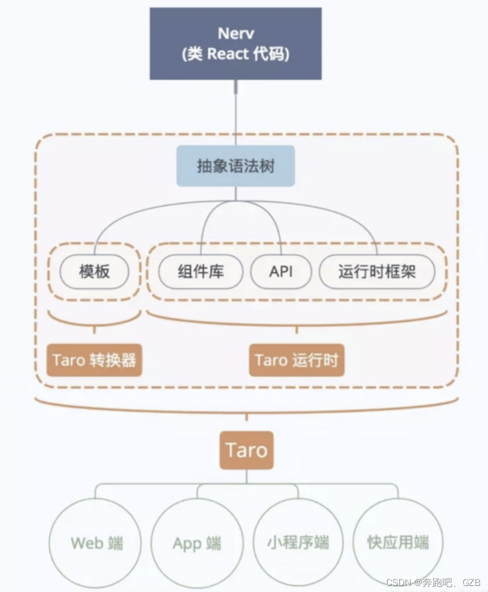

taro1/2

taro1/2 是编译类型的小程序跨平台框架。

taro是使用react进行小程序构建的。

React 与小程序之间最大的差异就是他们的模板了，在 React 中，是使用 JSX 来作为组件的模板的，而小程序则是使用字符串模板的。

1、模版转换
taro首先要实现的就是进行模版转换，把 JSX 语法转换成可以在小程序运行的字符串模板。

模版转换的实现：
模版转换主要是通过静态编译实现的，分为解析、转换、生成，三个阶段。

解析过程：babel 的核心编译器 babylon 是支持对 JSX 语法解析的，taro框架利用这个编译器，将JSX通过词法、语法分析，生成抽象语法树。

非常幸运的是 babel 的核心编译器 babylon 是支持对 JSX 语法的解析的，我们可以直接利用它来帮我们构造 AST，而我们需要专注的核心就是如何对 AST 进行转换操作，得出我们需要的新 AST，再将新 AST 进行递归遍历，生成小程序的模板。

转换过程：针对已经生成的AST（抽象语法树），taro框架会使用已经定义好的转换操作以及多端的组件库规则对它进行转换修改。

经@tarojs/transformer-wx转换，输出微信小程序模板：
@tarojs/components：支持Web环境Nerv组件库，通过编译替换为目标平台的原生标签/组件
@tarojs/taro-components-rn：支持ReactNative环境的React组件库
生成过程：将新 AST 进行递归遍历，生成小程序的模板。

2、逻辑转换
除了模版转换，还需要进行逻辑代码的转换，由于各端api存在差异，如网络请求，数据缓存等，所以为了弥补不同端的差异，Taro定制了统一的 API 标准，同时还为不同的端编写了相应的运行时框架，这些API可以直接使用，不用关心当前平台是否支持，因为运行时框架会抹平这些API差异。

组件库以及端能力都是依靠不同的端做不同实现来抹平差异

逻辑转换的实现：

运行时框架负责适配各端能力，以支持跑在上面的Taro业务代码，主要有3个作用：

适配组件化方案、配置选项等基础API

适配平台能力相关的API（如网络请求、支付、拍照等）

提供一些应用级的特性，如事件总线（Taro.Events、Taro.eventCenter）、运行环境相关的API（Taro.getEnv()、Taro.ENV_TYPE）、UI适配方案（Taro.initPxTransform()）等

实现上，@tarojs/taro是API适配的统一入口，编译时分平台替换：
@tarojs/taro：只是一层空壳，提供API签名

平台适配相关的package有6个：
@tarojs/taro-alipay：适配支付宝小程序
@tarojs/taro-h5：适配Web
@tarojs/taro-rn：适配ReactNative
@tarojs/taro-swan：适配百度小程序
@tarojs/taro-tt：适配头条小程序
@tarojs/taro-qapp：适配快应用

taro通过模版转换和逻辑转换，实现了跨平台多端构建小程序。

3、限制：
限制方面感受最深的应该是JSX，毕竟JSX的灵活性令人发指（动态组件、高阶组件），同时微信小程序的模板语法又限制极多（即便通过WXS这个补丁增强了一部分能力），这就出现了一个不可调和的矛盾，因此：

JSX 的写法极其灵活多变，我们只能通过穷举的方式，将常用的、React 官方推荐的写法作为转换规则加以支持，而一些比较生僻的，或者是不那么推荐的写的写法则不做支持，转而以 eslint 插件的方式，提示用户进行修改

具体地，JSX限制如下：

不支持动态组件
不能在包含 JSX 元素的 map 循环中使用 if 表达式
不能使用 Array#map 之外的方法操作 JSX 数组
不能在 JSX 参数中使用匿名函数
不允许在 JSX 参数(props)中传入 JSX 元素
只支持class组件
暂不支持在 render() 之外的方法定义 JSX
不能在 JSX 参数中使用对象展开符
不支持无状态组件（函数式组件）
props.children只能传递不能操作
对于这些转换限制，弥补性方案是Lint检查报错，并提供替代方案

除JSX外，还有2点比较大的限制：

CSS：受限于ReactNative的CSS支持程度（只能使用flex布局）

标签：约定 不要使用 HTML 标签（都用多端适配过的内置组件，如View、Button）

仅仅将代码按照对应语法规则转换过去后，还远远不够，因为不同端会有自己的原生组件，端能力 API 等等，代码直接转换过去后，可能不能直接执行。例如，小程序中普通的容器组件用的是 view ，而在 H5 中则是 div；小程序中提供了丰富的端能力 API，例如网络请求、文件下载、数据缓存等，而在 H5 中对应功能的 API 则不一致。

可能有些人会有疑问，既然是为不同的端实现了对应的组件库与端能力 API （小程序除外，因为组件库和 API 的标准都是源自小程序），那么是怎么能够只写一份代码就够了呢？因为我们有编译的操作，在书写代码的时候，只需要引入标准组件库 @tarojs/components 与运行时框架 @tarojs/taro ，代码经过编译之后，会变成对应端所需要的库。

taro3

Taro 3 则可以大致理解为运行时或解释型架构（相对于 Taro 1/2 而言）。
主要通过在小程序端模拟实现 DOM、BOM API 来让前端框架直接运行在小程序环境中，从而达到小程序和 H5 统一的目的。
通过在逻辑层模拟 DOM/BOM API，将这些创建视图的方法转换为维护一棵 VDOM 树，再将其转换成对应 setData 的数据，最后通过预置好的模板递归渲染出实际视图。

而对于生命周期、组件库、API、路由等差异，我们依然可以通过定义统一标准，各端负责各自实现的方式来进行抹平。
而正因为 Taro 3 的原理，所以 Taro 3 中同时支持 React、Vue 等框架，甚至还支持了 jQuery，比如 Angular，Taro 3 整体架构如下。

诞生基础
对于现代的前端框架（React/Vue）来说，底层基本都是通过调用 DOM API 来创建视图。而小程序的视图层模板是需要开发者事先写好的，这意味着动态创建 DOM 的方式在小程序中不被允许。但是，小程序的自定义组件具有的『自引用』特性为动态创建 DOM 打开了突破口。所谓自引用，就是自定义组件支持使用自己作为子节点，也就意味着通过递归引用的方式，我们能够构造任意层级和数量的 DOM 树。

举例来说，假设一个小程序自定义组件 element 的 WXML 模板如下所示：

<view
  wx:if="{{r.tagName === 'view'}}"
  id="{{r.nodeId}}"
>
  <block  
    wx:for=“{{r.children}}”   
    wx:key="nodeId"
  >
      <element data="{{r: item}}" />
  </block>
</view>
 
<text 
  wx:elif="{{r.tagName === 'text'}}"
>
  {{r.content}}
</text>

注意到，element 在模板中递归引用了自身，并通过条件判断终止递归。那么，当逻辑层通过 setData 传递了以下一份数据过来时：

{
  "nodeId": "1",
  "tagName": "view",
  "children": [
    {
      "nodeId": "2",
      "tagName": "text",
      "content": "我是？"
    },
    {
      "nodeId": "3",
      "tagName": "text",
      "content": "rax"
    }
  ]
}

最终呈现出来的视图便成了：

<view>
  <text>我是</text>
  <text>rax</text>
</view>
通过这种方式，我们巧妙地实现了在 WXML 模板固定的情况下，根据传入的 setData 数据来动态渲染视图的能力。而这，也正是运行时方案能够诞生的基础。
————————————————
 

 https://blog.csdn.net/qq_41635167/article/details/121917144