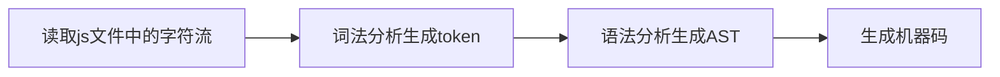
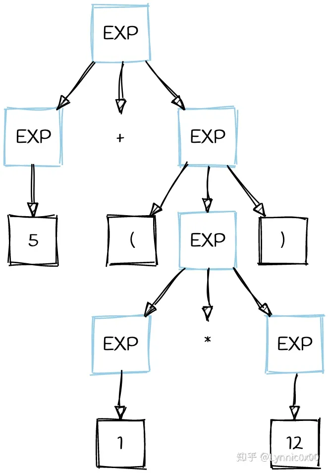
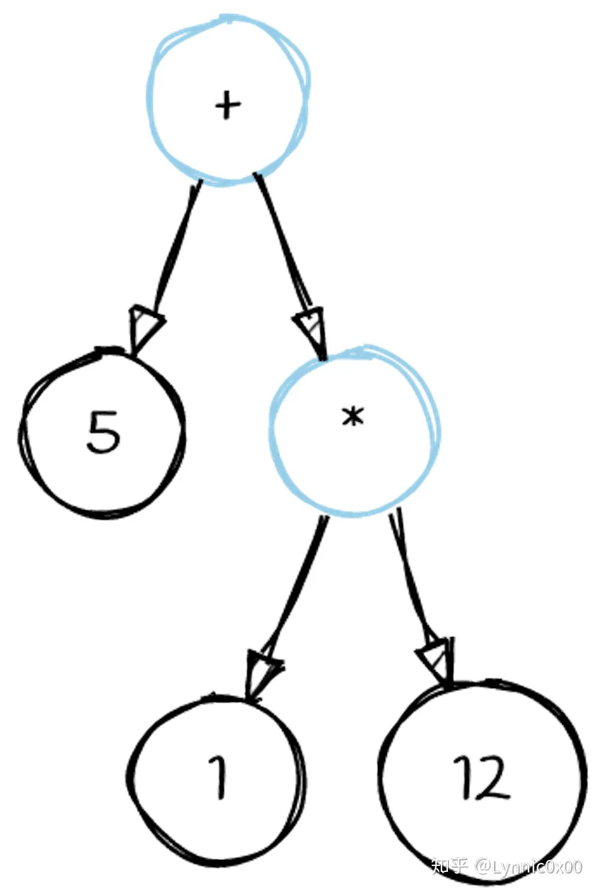

# 抽象语法树

抽象语法树 (Abstract Syntax Tree)，简称 AST，它是源代码语法结构的一种抽象表示。它以树状的形式表现编程语言的语法结构，树上的每个节点都表示源代码中的一种结构

## 应用

- 编辑器的错误提示、代码格式化、代码高亮、代码自动补全；

- `eslint`、`pretiier` 对代码错误或风格的检查；

- webpack 通过 babel 转译 javascript 语法；

## AST 如何生成

js 执行的第一步是读取 js 文件中的字符流，然后通过词法分析生成 token，之后再通过语法分析( Parser )生成 AST，最后生成机器码执行

`JS Parser` 是 js 语法解析器，它可以将 js 源码转成 AST，常见的 Parser 有 esprima、traceur、acorn、shift 等

### 词法分析
词法分析，也称之为扫描（scanner），简单来说就是scanner会从左到右扫描文本，把文本拆成一些单词。然后，这些单词传入分词器，经过一系列的识别器（关键字识别器、标识符识别器、常量识别器、操作符识别器等），确定这些单词的词性，这一过程的产物是token序列

token在机内一般用<type, value>形似的二元组来表示，type表示一个单词种类，value为属性值

例如 var 这三个字符，它只能作为一个整体，语义上不能再被分解，因此它是一个 Token，它的type本身就可表示这个关键字，不再需要属性值， 用二元组表示就是<VAR, ->

词法分析器里，每个关键字是一个 Token ，每个标识符是一个 Token，每个操作符是一个 Token，每个标点符号也都是一个 Token。除此之外，还会过滤掉源程序中的注释和空白字符（换行符、空格、制表符等)

例如，const foo = 42;。这段程序通常会被分解成为下面这些词法单元：const, foo, =, 42 , ;

最终，整个代码将被分割进一个tokens列表

### 语法分析

token序列会经过我们的解析器，由解析器识别出代码中的各类短语，会根据语言的文法规则(rules of grammar)输出解析树，同时，验证语法，语法如果有错的话，抛出语法错误

#### 解析树 具象语法树

文法可表示为:

G=(T,N,P,S)

T表示终结符的集合（如little、girl等，即词法分析中提到的token）

N表示非终结符的集合（如<>里包括的部分，表示了语法成分， 因为它们可以推导出其他句子成分，所以称为非终结符）

P表示产生式集合（上面分析英语句子的每一条规则都是一个产生式，如<动词短语> -> <动词> <名词短语>， 就是一个产生式）

S表示开始符号（S属于N的子元素，是一个特殊的非终结符）

5 + (12 * 1)根据对应的文法生成的解析树

#### 抽象语法树

上文可见，根据文法规则生成的解析树会非常冗余。例如EXP->1这种结点，看上去有点冗余，我们把这种结点叫做单继承节点，实际上我们并不会关心EXP是什么，只会关心继承它的那个值，这里即1；再例如我们发现括号似乎也是冗余的，可以隐藏在树的结构中

把冗余的层修剪掉，我们可以得到一颗AST树

### Ast部分节点解释
program: 包含整个源代码，不包含注释节点。

type: 表示当前节点的类型

start：表示当前节点的起始位置

end：表示当前节点的末尾

loc：表示当前节点所在的行列位置

loc中的start，表示节点所在起始的行列位置

loc中的end，表示节点所在末尾的行列位置

sourceType：表示节点的源代码类型（js，python等），module表示为模块类型

body：表示代码块的主体部分。通过解析Ast中的body节点，可以提取出代码块的主体部分，并进行相应的处理或分析。这对于理解代码逻辑、调试和维护代码非常有用。

body节点通常会包含一个type的子节点，该子节点表示body代码块中包含的节点类型，常用的节点类型有：
ExpressionStatement：表示一个表达式语句，用于执行某些操作或计算
IfStatement：表示一个条件语句，根据条件执行不同的代码块。
ReturnStatement：表示一个return语句，用于从函数中返回一个值。
Identifier：表示被遍历节点的标识符
comments：用于存储存储源代码中的注释信息 

参考：
https://www.cnblogs.com/yogayao/p/17864731.html

https://blog.csdn.net/weixin_47128751/article/details/116267736

ast解析
https://blog.csdn.net/qq_35484495/article/details/143065909
AST转换
https://zhuanlan.zhihu.com/p/617125984

ast在线工具
https://ast.89tool.com/
https://astexplorer.net/

